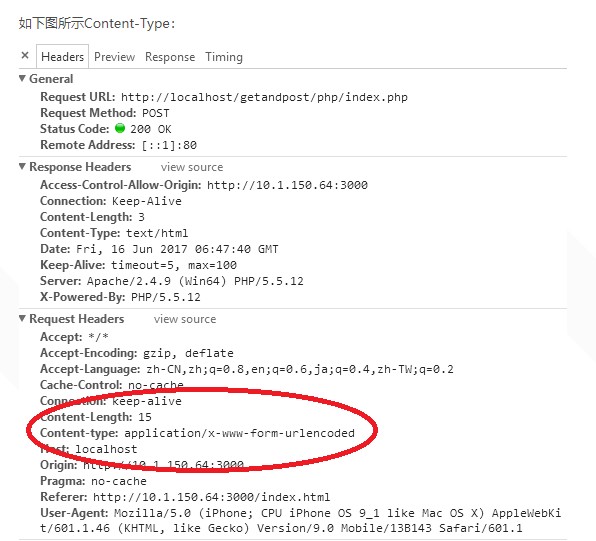

## 金渡教育   内部资料,请勿外传*,*违者必究 ！！！QQ：2429462491


## HTTP

HTTP协议即超文本传送协议(Hypertext Transfer Protocol )，是Web联网的基础，也是手机联网常用的协议之一，HTTP协议是建立在TCP协议之上的一种应用(`TCP是传输层，而http是应用层`)。

HTTP的交互流程简单来讲就是客户端与服务器端的通信，包括客户端对服务器端的请求以及服务器端对客户端的响应。

客户端与服务器端建立一个连接，三次握手经历完成之后才能建立一个稳定可靠的连接。

#### 三次握手

第一次握手：客户端给服务器端发送一个syn的标志位；服务器端接收到syn后会返回一个ack(相当于一个回调的机制)，同时还有一个服务器端的syn；客户端接收服务器端发送的syn后会再次给服务器端发送一个ack，这样才算完成三次握手。


#### 四次分手

客户端向服务器端发送断开连接的请求；服务器端接收到请求后，返回可以断开连接的请求，客户端断开连接并且释放资源；服务器端向客户端发送断开连接的信息；客户端向服务器端发送同意断开连接的信息，服务器端断开连接释放资源。


**建立连接要3次，断开为什么要4次呢**

因为tcp是全双工的，每个方向要单独断开，每个方向2次，所以4次。

#### 协议规范

HTTP协议是一个规范。一定会限制请求的格式。
http协议的请求格式分为3个部分：请求行、请求头、请求体。

##### 请求行

包括三个属性。描述对应的请求的时候，最精确的形式就是K-V键值对的格式。
请求头中也是一堆的K-V数据。包含头信息中的一些附加信息(比如客户端允许接收的信息格式)。

##### 请求头

提供了关于请求,响应或者其他的发送实体的信息

###### Content-Type

- text/plain 纯文本
- application/x-www-form-urlencoded 指定内容类型为键值对
- application/octet-stream 二进制流数据
- application/json  json数据格式
- multipart/form-data  formdata表单数据格式



##### 请求体

当发送某一个请求的时候，请求后面可以加一些用户定义的参数(比如表单)。以K=V的形式发送给后台。


## 服务启动

#### 什么是Node?

Node.js 是一个基于 Chrome V8 引擎的 JavaScript 运行时。

#### 开发框架

- Express 快速、开放、极简的 Web 开发框架。
- Koa 下一代 web 开发框架。
- Egg 为企业级框架和应用而生。

#### 启动node服务

创建包文件：`npm init`

安装依赖：`npm i -S express body-parser`

启动：`node xxx.js`

停止：`ctrl+c`

## 数据交互

#### 原生请求

- xhr

  ```javascript
  var xmlhttp = getXMLHttpRequest();
              // xmlhttp.open("get", "http://localhost:3000/info?name=jack", true);
              // xmlhttp.send();
  
              // json
              // xmlhttp.open("post", "http://localhost:3000/info4", true);
              // xmlhttp.setRequestHeader("Content-Type","application/json");
              // xmlhttp.send(JSON.stringify({"name":"joho", "age":20}));
  
              //formdata
              // xmlhttp.open("post", "http://localhost:3000/info41", true);
              // var formdata = new FormData();
              // formdata.append("name", "joho");
              // formdata.append("age", 20)
              // xmlhttp.send(formdata);
  
              xmlhttp.onreadystatechange = function(){
                  if (xmlhttp.readyState == 4 && xmlhttp.status == 200) {
                      console.log(xmlhttp.responseText);
                  }
              }
  ```

  

- Fetch

  ```javascript
  //get
              fetch('http://localhost:3000/info?name=jack')
                .then(function(response) {
                  return response.json();
                })
                .then(function(myJson) {
                  console.log(myJson);
                });
              //post
              fetch('http://localhost:3000/info4', {
                  body: JSON.stringify({"name":"joho", "age":20}),
                  headers: {
                      'content-type': 'application/json'
                  },
                  method: 'POST',
              })
                .then(function(response) {
                  return response.json();
                })
                .then(function(myJson) {
                  console.log(myJson);
                });
              //formdata
              var formdata = new FormData();
              formdata.append("name", "joho");
              formdata.append("age", 200)
              fetch('http://localhost:3000/info41', {
                  body: formdata,
                  method: 'POST',
              })
                .then(function(response) {
                  return response.json();
                })
                .then(function(myJson) {
                  console.log(myJson);
                });
  ```

  

#### 参数解析

获取请求很中的参数是每个web后台处理的必经之路，nodejs的 **express框架** 提供了3种方法来实现。

1. req.body

   包含了提交数据的键值对在**请求体**中，默认是underfined,
   你可以用body-parser或者multer来解析body

   对应前端传入参数及内容类型如下：

   `application/json`

   `{"name"="jack"}`

   `req.body.name`

2. req.query

   包含在**路由**中每个查询字符串参数属性的对象。如果没有，默认为{}

   注：此方法多适用于GET请求，解析GET里的参数

   `application/x-www-form-urlencoded`

   `// GET /search?q=tobi+ferret
   req.query.q`

3. req.params

   包含映射到指定的路线“参数”属性的对象。
   例如，如果你有route/user/：name，那么“name”属性可作为req.params.name。
   该对象默认为{}。

   `// GET /user/tj
   req.params.name
   // => "tj"`
   多适用于restful风格url中的参数的解析

4. Formdata

   处理formdata需要下载依赖包multiparty。

   ```javascript
   npm i multiparty -S
   
   router.post("/test", function(req, res) {
       var form = new multiparty.Form();
       form.parse(req, function(err, fields, files) {
              //fields：类似post 的一些字符串，
              //files 文件
       })
   })
   ```

   

**req.query与req.params区别**
req.params包含路由参数（在URL的路径部分），而req.query包含URL的查询参数（在URL的？后的参数）。


## 跨域

#### 什么是跨域

跨域是指从一个域名的网页去请求另一个域名的资源。比如从www.baidu.com 页面去请求 www.google.com 的资源。跨域的严格一点的定义是：只要**协议**，**域名**，**端口**有任何一个的不同，就被当作是**跨域**。

#### 为什么浏览器要限制跨域访问呢？

原因就是安全问题：如果一个网页可以随意地访问另外一个网站的资源，那么就有可能在客户完全不知情的情况下出现安全问题。

#### 为什么要跨域（从一个页面引用其它页面的资源）

既然有安全问题，那为什么又要跨域呢？有时公司内部有多个不同的子域，比如一个是location.company.com ,而应用是放在app.company.com , 这时想从 app.company.com去访问 location.company.com 的资源就属于跨域

#### 跨域解决方案

- cors
- nginx
- jsonp

##### cors

```javascript
app.use(function (req, res, next) {
 res.setHeader('Access-Control-Allow-Origin', '*');
 res.setHeader('Access-Control-Allow-Methods', 'GET, POST, OPTIONS, PUT, DELETE');
 res.setHeader('Access-Control-Allow-Headers', '*');
 next();
});
```

##### nginx

Windows: 在nginx目录查找nginx.conf文件并添加以下内容

Mac: open -t /usr/local/etc/nginx/nginx.conf

**mac默认ng端口8080**

```nginx
server {
		listen       8089;
		server_name  localhost;
		root   html;    #根目录
		# cors
		add_header Access-Control-Allow-Origin $http_origin always;  # '*' 
		add_header Access-Control-Allow-Credentials true always;
		add_header Access-Control-Allow-Methods 'GET, POST, OPTIONS' always;
		add_header Access-Control-Allow-Headers 'DNT,X-Mx-ReqToken,Keep-Alive,User-Agent,X-Requested-With,If-Modified-Since,Cache-Control,Content-Type,Authorization' always;

		#请求http://localhost:8080/api，将该请求转发到http://localhost:3000/api
		location /api {
			proxy_pass http://localhost:3000/api;
		}
	}
```

关于Mac下操作：

`brew services start nginx`

`brew services stop nginx`

##### jsonp

```javascript
app.get("/api/jsonp", function(req, res){
    var data = {name: "jsonp数据"}
    data = JSON.stringify(data); //转字符串
    var callback = `${req.query.callback}(${data})`; //函数名+数据
    console.log(callback)
    res.send(callback);
})
function getJsonp() {
    $.ajax({
      url: "http://localhost:3000/api/jsonp",
      data: {name: "xxxx"},
      dataType: "jsonp",
      jsonpCallback: "handleResponse"
    })
};
function handleResponse(data) {
    console.log(data);
}
```


## 设计模式

设计模式（Design Pattern）是前辈们对代码开发经验的总结，是解决特定问题的一系列套路。它不是语法规定，而是一套用来提高代码可复用性、可维护性、可读性、稳健性以及安全性的解决方案。

1995 年，GoF（Gang of Four，四人组/四人帮）合作出版了《设计模式：可复用面向对象软件的基础》一书，共收录了 23 种设计模式，从此树立了软件设计模式领域的里程碑，人称「GoF设计模式」。

这些模式可以分为三大类：**创建型模式**（Creational Patterns）、**结构型模式**（Structural Patterns）、**行为型模式**（Behavioral Patterns）。

**创建型模式**

- 工厂模式（Factory Pattern）
- 抽象工厂模式（Abstract Factory Pattern）
- 单例模式（Singleton Pattern）
- 建造者模式（Builder Pattern）
- 原型模式（Prototype Pattern）

**结构型模式**

- 适配器模式（Adapter Pattern）
- 桥接模式（Bridge Pattern）
- 过滤器模式（Filter、Criteria Pattern）
- 组合模式（Composite Pattern）
- 装饰器模式（Decorator Pattern）
- 外观模式（Facade Pattern）
- 享元模式（Flyweight Pattern）
- 代理模式（Proxy Pattern）

**行为型模式**

- 责任链模式（Chain of Responsibility Pattern）
- 命令模式（Command Pattern）
- 解释器模式（Interpreter Pattern）
- 迭代器模式（Iterator Pattern）
- 中介者模式（Mediator Pattern）
- 备忘录模式（Memento Pattern）
- 观察者模式（Observer Pattern）
- 状态模式（State Pattern）
- 空对象模式（Null Object Pattern）
- 策略模式（Strategy Pattern）
- 模板模式（Template Pattern）
- 访问者模式（Visitor Pattern）

**设计模式的六大原则**

1. **开闭原则（Open Close Principle）**

   意思是：**对扩展开放，对修改关闭**。

2. **里氏代换原则（Liskov Substitution Principle）**

   里氏代换原则中说，任何基类可以出现的地方，子类一定可以出现。

3. **依赖倒转原则（Dependence Inversion Principle）**

   具体内容：针对接口编程，依赖于抽象而不依赖于具体

4. **接口隔离原则（Interface Segregation Principle）**

   使用多个隔离的接口，比使用单个接口要好，降低类之间的耦合度。。

5. **迪米特法则，又称最少知道原则（Demeter Principle）**

   一个实体应当尽量少地与其他实体之间发生相互作用，使得系统功能模块相对独立。

6. **合成复用原则（Composite Reuse Principle）**

   尽量使用合成/聚合的方式，而不是使用继承。

其实设计模式就是从**大型软件架构**出发、便于升级和维护的软件设计思想，它强调降低依赖，降低耦合。

#### 观察者模式

当一个对象数据发生变化时，通知其它一系列对象，让其响应这种变化

观察者设计模式中主要区分两个概念：

**观察者**：指观察者对象，也就是消息的订阅者；

**被观察者**：指要观察的目标对象，也就是消息的发布者。

```javascript
class Subject{//发布者
  constructor(){
    this.subs = [];
  }
  addSub(sub){
    this.subs.push(sub);
  }
  notify(food){
    this.subs.forEach(sub=> {
      sub.update(food);
    });
  }
}
class Observer{//订阅者
  constructor(name, food){
	this.name = name;
	this.food = food;
  }
  update(food){
    if(food===this.food){
		console.log(this.name + "的外卖："+food);
	}
  }
}
var subject = new Subject();
var tom = new Observer("tom","地三鲜");
var jack = new Observer("jack","红烧肉");
//目标添加观察者了
subject.addSub(tom);
subject.addSub(jack);
//目标发布消息调用观察者的更新方法了
subject.notify("地三鲜");
subject.notify("红烧肉");

```

优点：

1. **观察者模式在被观察者和观察者之间建立一个抽象的耦合**。**被观察者**角色所知道的只是一个具体**观察者列表**，每一个具体观察者都符合一个抽象观察者的接口。**被观察者并不认识任何一个具体观察者**，它只知道它们都有一个**共同的接口**。由于被观察者和观察者没有紧密地耦合在一起，因此它们可以**属于不同的抽象化层次**。如果被观察者和观察者都被扔到一起，那么这个对象必然跨越抽象化和具体化层次。
2. **观察者模式支持广播通讯**。被观察者会向所有的登记过的观察者发出通知。


#### 代理模式

代理是一个对象，跟本体对象**具有相同的接口**，以此达到对本体对象的访问控制。

代理，顾名思义，即**代替被请求者来处理相关事务**。代理对象一般会全权代理被请求者的全部只能，客户访问代理对象就像在访问被请求者一样，虽然代理对象最终还是可能会访问被请求者，但是其可以在请求之前或者请求之后进行一些额外的工作，或者说客户的请求不合法，直接拒绝客户的请求。

```javascript
// 声明女孩对象
var girl = function (name) {
    this.name = name;
};
// 声明男孩对象
var boy = function (girl) {
    this.girl = girl;
    this.sendGift = function (gift) {
        alert("Hi " + girl.name + ", 男孩送你一个礼物：" + gift);
    }
};
// 声明代理对象
var proxyObj = function (girl) {
    this.girl = girl;
    this.sendGift = function (gift) {
        (new boy(girl)).sendGift(gift); // 替dudu送花咯
    }
};
var proxy = new proxyObj(new girl("花花"));
proxy.sendGift("999朵玫瑰");

```

优点：代理对象可以代替本体对象被实例化，此时本体对象未真正实例化，等到合适时机再实例化。

代理模式可以**延迟创建开销很大的本体对象**，他会把本体的实例化推迟到有方法被调用时。

#### 工厂模式

最常用的设计模式之一，这种类型的设计模式属于创建型模式,它提供了一种创建对象的最佳方式。 

```javascript
// function
var MobileFactory = (function () {
    var Mobile = function (name,model){
        this.model = model;
        this.name = name;
    };
	Mobile.prototype.play=function(){
		console.log("Mobile:"+this.name+"-"+this.model)
	}
    return function (name,model) {
        return new Mobile(name,model);
    };
})();

var p6 = new MobileFactory("iphone", "6");
var px = new MobileFactory("iphone", "X");
p6.play()
px.play()
//Creator是个工厂，有个create函数，工厂通过create创建Product
class Product {
	constructor(name, model) {
		this.name = name
		this.model = model;
	}
	play(){
		console.log("Mobile:"+this.name+"-"+this.model)
	}
}

class FactoryCreator {
	create(name,model) {
		return new Product(name,model)
	}
}
let creator = new FactoryCreator()
// 通过工厂省城product的实例
let p = creator.create('iphone',"6")
p.play();
let p2 = creator.create('iphone',"7")
p2.play()
```

**优点**

1. 工厂类含有必要的判断逻辑，可以决定在什么时候创建哪一个产品类的实例，客户端可以免除直接创建产品对象的责任，而仅仅"消费"产品。工厂模式通过这种做法实现了对责任的分割。

2. 当产品有复杂的多层等级结构时，工厂类只有自己，以不变应万变，就是模式的缺点。因为工厂类集中了所有产品创建逻辑，一旦不能正常工作，整个系统都要受到影响。

**缺点**

1. 系统扩展困难，一旦添加新产品就不得不修改工厂逻辑，有可能造成工厂逻辑过于复杂, **违背了"开放--封闭"原则(OCP)** .

#### 单例模式

系统中被唯一使用，一个类只有一个实例

```javascript
class Store {
	action() {
		console.log('vue store.')
	}
}
// 定义一个静态的方法，将方法挂载到class上面,无论SingleObject被new多少个，getInstance的方法只有一个
Store.getInstance = (function() {
	let instance
	return function() {
		if (!instance) {
			instance = new Store();
		}
		return instance
	}
})()

// js中的单例模式只能靠文档去约束，不能使用private关键字去约束
// 测试：注意这里只能使用静态函数getInstance,不能使用new Store()
let obj1 = Store.getInstance()
obj1.action()
let obj2 = Store.getInstance()
obj2.action()

// 单例模式(唯一的)，每次获取的都是一个东西，所以他两相等，否则就不是单例模式
console.log(obj1 === obj2) //true
```

优点： 

1. 在单例模式中，活动的单例只有一个实例，对单例类的所有实例化得到的都是相同的一个实例。这样就防止其它对象对自己的实例化，确保所有的对象都访问一个实例 
2. 避免对共享资源的多重占用。

#### 适配器模式

将原本不适合的数据转换为适合的数据(计算属性)。

将原本不适合的接口转换为适合的接口。

```javascript
class IPhoneX {
    constructor(){
		this.interface = "平接口type-c";
	}
}

class Adapter {
    constructor(oldInter, newInter) {
        this.phone = new IPhoneX() // 初始化实例
        this.oldInter = oldInter
        this.newInter = newInter
    }
    getOldInter() {
        return this.oldInter
    }
	translate(p, newInter){ //模拟转接头
		console.log(`${p.interface}---->>${newInter}`)
	}
    getInter() { // 覆盖
		this.translate(this.phone, this.newInter);
        return this.newInter
    }
}

let adapter = new Adapter('圆接口', '平接口')
let res = adapter.getInter()
console.log(res) // 圆接口

res = adapter.getOldInter()
console.log(res) // 平接口
```

优点：

1. 将**目标类**和**适配者类**解耦.

2. 增加了类的透明性和复用性，将具体的实现封装在适配者类中.

#### 装饰器模式

允许向一个现有的对象添加新的功能，同时又不改变其结构。

**比喻：**

假如我有一个蛋糕，如果在上面加上奶油其他什么都不加，那么它就成了一个奶油蛋糕。如果再加上草莓，那就是草莓奶油蛋糕，如果再加上一块巧克力板，上面写上姓名，然后插上蜡烛，就变成了一块生日蛋糕。

不论是蛋糕，奶油蛋糕，草莓蛋糕还是生日蛋糕，它们的核心都是蛋糕。不过，在加上一系列装饰之后，它变得更加甜美了，目的也更加明确了。装饰器模式中的被装饰对象和蛋糕很相似。

```javascript
class Circle {
	draw() {
		console.log('我要画一个圆')
	}
}

class Decorator {
	constructor(circle) {
		this.circle = circle
	}
	draw() {
		this.circle.draw()
		this.setBorder(circle)
	}
	setBorder(circle) {
		console.log('加上边框')
	}
} 
// 想引用某个类的时候将他实例化，以参数的形式进行传递进去
let circle = new Circle()
circle.draw()
console.log('+++++')
let dec = new Decorator(circle)
dec.draw()
```

优点：装饰类和被装饰类可以独立发展，不会相互耦合，装饰模式可以动态扩展一个实现类的功能。

**装饰器模式和代理模式的区别：**

**装饰器模式关注于在一个对象上动态的添加方法**，然而**代理模式关注于控制对对象的访问**。换句话说，用代理模式，代理类（proxy class）可以对它的客户隐藏一个对象的具体信息。因此，当使用代理模式的时候，我们常常在一个代理类中创建一个对象的实例。并且，当我们使用装饰器模式的时候，我们通常的做法是**将原始对象作为一个参数传给装饰者的构造器**。

**装饰器模式与适配器模式的区别**

装饰器与适配器都有一个别名叫做**包装模式(Wrapper)**，它们看似都是起到包装一个类或对象的作用，但是使用它们的目的很不一一样。**适配器模式的意义是要将一个接口转变成另一个接口，它的目的是通过改变接口来达到重复使用的目的。**
而装饰器模式**不是要改变被装饰对象的接口**，而是恰恰要保持原有的接口，但是增强原有对象的功能，或者改变原有对象的处理方式而提升性能。所以这两个模式设计的目的是不同的。

## 设计模式分析

依赖具体：

老板要造一辆小车，找最好的工匠制作最好的零部件，如轮胎，底盘等，由于长时间使用一些零件开始损坏，如轮胎破了需要再做新的，再找工匠对比之前的轮胎制作。

依赖抽象：

老板要造一辆小车，先找最好的设计人员设计出详细的尺寸，规格等，并找工匠实现出原型产品，当原型产品损坏后，可以再照着设计图再制作轮胎，自己制作还可以扩展，如加上自己的签名，特别的花纹等。

## 组件封装

封账就是隐藏实现细节，仅对外提供访问的接口。内部的具体实现细节我不关心。

#### 封装好处

- 模块化，分工明确
- 信息隐藏
- 代码重用

#### HttpAjax组件封装

```javascript
// 封装原生XMLHttpRequest请求
function createXMLHttp(baseUrl) {
    // 低版本IE兼容
    var XmlHttp = window.XMLHttpRequest ? new XMLHttpRequest() : ActiveXobject("Msxml12.XMLHTTP");
    // 默认请求 协议、IP、port
    var defaultURL = baseUrl ? baseUrl : "http://localhost:3000";
    return {
        sendRequest({method='GET', url, data=null, success, error}) {
            XmlHttp.open(method, defaultURL + url);
            if (method == "GET") {
                XmlHttp.send();
            } else {
                XmlHttp.setRequestHeader("Content-Type", "application/json")
                XmlHttp.send(data);
            }
            XmlHttp.onreadystatechange = function (resp) {
                if (XmlHttp.readyState == 4 && XmlHttp.status == 200) {
                    success(resp);
                }
            };
            XmlHttp.onerror = function (err) {
                error(err);
            }
        }
    }
}
```

